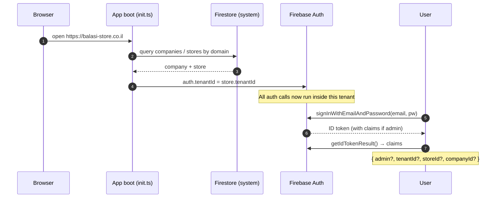

# Auth & tenant

How users sign in, how their tenant context is established, and what
custom claims the system relies on. Builds on the [Multi-tenant](./multi-tenant)
page — read that first.

## Two user kinds

| | Customer | Admin |
| --- | --- | --- |
| **How they exist** | Self-register (`createUserWithEmailAndPassword`) or guest checkout (`signInAnonymously`) | Created by the platform owner via `packages/scripts/src/index.ts` (`createAdmin` action) |
| **Custom claims** | None | `{ admin: true, tenantId, storeId, companyId }` |
| **Tenant binding** | Implicit — Firebase tenant set on the auth instance after domain resolution; backend derives company/store from the entity they're acting on (e.g. the order they own) | Explicit — claims carry the tenant; backend reads from `auth.token` |
| **Where their `TProfile` lives** | `{companyId}/{storeId}/profiles/{uid}` | Same, plus the auth account exists in the store's Firebase tenant |

Anonymous users are first-class: they can browse, add to cart, even check out. When they later sign up, `linkWithCredential` upgrades the anonymous account into a real one, keeping the same `uid` (and so the same cart).

## How tenant gets into auth

The full sequence from a fresh browser tab to a logged-in user:



The critical step is `auth.tenantId = store.tenantId` in `Auth.setTenantId` ([apps/store/src/lib/firebase/auth.ts:23](apps/store/src/lib/firebase/auth.ts)). Every subsequent sign-in, sign-up, and token refresh happens inside that Firebase tenant. A user from store A literally cannot authenticate against store B's domain — Firebase rejects it at the auth layer.

## Custom claims

The platform sets claims **only** for admins. The `createAdmin` script in `packages/scripts/src/index.ts` ([line 38-52](packages/scripts/src/index.ts#L38)):

```ts
const auth = admin.auth().tenantManager().authForTenant(selectedStore.tenantId);
const userRecord = await auth.createUser({
  displayName, email, password, emailVerified: true,
});
await auth.setCustomUserClaims(userRecord.uid, {
  admin: true,
  tenantId: selectedStore.tenantId,
  storeId:  selectedStore.id,
  companyId: selectedStore.companyId,
});
```

One admin = one store. The claims pin the admin to exactly one (`companyId`, `storeId`). To give an admin access to a second store, you'd create them as a separate user under that store's tenant — there is no cross-store admin today.

**Customers** get the empty claim set. On their token, `admin === undefined`, `companyId === undefined`, `storeId === undefined`.

## Backend callable patterns

There are three classes of callable in the system, each with a different auth model:

### 1. Admin-only

The canonical pattern — used by everything in the admin app:

```ts
export const someAdminEndpoint = functionsV2.https.onCall(
  async (request) => {
    const { auth } = request;
    if (!auth?.token.admin) {
      return { success: false, error: "Unauthorized" };
    }

    const companyId = auth.token.companyId as string | undefined;
    const storeId   = auth.token.storeId   as string | undefined;
    if (!companyId || !storeId) {
      return { success: false, error: "missing_token_claims" };
    }
    // … use companyId / storeId for Firestore paths …
  }
);
```

Rules:
- **Always** check `admin === true` first.
- **Always** derive `companyId` / `storeId` from `auth.token`, **never** from `request.data`.
- For endpoints that act on a referenced entity (an order, an invoice, a delivery note), additionally verify the entity belongs to the caller's tenant — see `verifyInvoiceBelongsToTenant` in [`postManualTransaction.ts`](functions/src/modules/ledger/api/postManualTransaction.ts) for the canonical ownership check.

### 2. Customer-owned-entity

Used by customer flows where the user must own the entity they're acting on (e.g. paying for their own order):

```ts
// Customer checkout — the user must be signed in (anonymous OK) and must own the order.
const uid = auth?.uid;
if (!uid) return { success: false, error: "unauthenticated" };

const order = await loadOrder(orderId);   // load by id from a path the customer's app supplied
if (order.userId !== uid) return { success: false, error: "not_owner" };
```

The tenant (`companyId` / `storeId`) for these endpoints is derived from the **entity** (`order.companyId`, `order.storeId`), not from the customer's token (which has no tenant claim). This is safe because:

- The user must already be inside the right Firebase tenant to be authenticated at all (set on boot, see above)
- The entity itself carries authoritative tenant data
- The ownership check (`order.userId === uid`) prevents acting on someone else's entity

### 3. VERIFY-gated (HYP redirect)

A narrow category for the payment-redirect endpoints (`recordHypJ5Auth`, `recordHypDirectPayment`). HYP returns the customer to the storefront with signed result parameters; the server verifies them with HYP's VERIFY API before writing.

The integrity control is the **VERIFY round-trip** — not an admin claim, and not entity ownership. See [Ledger module](/modules/ledger) for details.

## The IDOR pitfall

The single most dangerous pattern to avoid:

```ts
// ❌ DANGEROUS — DO NOT USE
if (auth?.token.storeId && auth.token.storeId !== request.data.storeId) {
  return { error: "Unauthorized" };
}
// proceed with request.data.storeId as the tenant
```

Because customers' tokens have `token.storeId === undefined`, the `&&` short-circuits to `false` and the guard never fires. The customer can then pass **any** `storeId` in the request body and the endpoint will write to that store. This is a cross-tenant IDOR — one store's customer can corrupt or read another store's data.

**The correct pattern** (Section 1 above): require `admin === true` AND read `companyId`/`storeId` from `auth.token` only.

If a customer-facing endpoint genuinely needs a tenant, it must derive it from an entity the customer demonstrably owns (Section 2), not from the request body.

## The `TProfile` document

Every authenticated user has a Firestore profile at `{companyId}/{storeId}/profiles/{uid}` shaped by `ProfileSchema` ([Profile.ts](packages/core/lib/entities/Profile.ts)):

| Field | Notes |
| --- | --- |
| `id` | Same as Firebase `uid` |
| `companyId`, `storeId`, `tenantId` | Tenant scope baked into the doc |
| `email` | From the auth credential |
| `displayName` | User-supplied at signup |
| `isAnonymous` | `true` for guest sessions, flipped to `false` on link-credential signup |
| `organizationIds` | B2B — array of orgs this user is part of. Drives credit-terms behavior, billing accounts, etc. |
| `paymentType` | Default payment preference (HYP / cash / credit terms) |
| `createdDate`, `lastActivityDate` | Audit timestamps |
| `organizationId` (deprecated) | Replaced by `organizationIds[]` — see `migrateProfiles.ts` |
| `clientType` (deprecated) | Was `"user" \| "company"` — semantics now carried by `organizationIds.length > 0` |

`onUserDelete` ([functions/src/modules/auth/triggers/user.ts](functions/src/modules/auth/triggers/user.ts)) is the Firebase Auth trigger that deletes the matching Firestore profile when an auth user is deleted.

## B2B linkage

Customers can belong to organizations (`profile.organizationIds: string[]`). This is what powers credit-terms B2B flows:

- An order's `organizationId` is set when a B2B customer checks out
- The org's billing accounts and credit limits gate what they can do
- AR accrues/settles **at the org level**, not at the individual customer level — see [Money & documents](./money-and-documents)

A customer can be in zero, one, or many organizations. A single Firebase user binds to a single Firebase tenant (= store) but can have org membership inside that store.

## Common pitfalls

| Pitfall | What goes wrong |
| --- | --- |
| Truthy-and-equals guard (`if (token.storeId && token.storeId !== input.storeId)`) | Short-circuits for customers — IDOR |
| Trusting `request.data.companyId` or `.storeId` for path construction | Caller can switch tenants by lying in payload |
| Forgetting the `admin === true` check before reading `companyId` / `storeId` from token | A customer who somehow gets `companyId` in their token (test data leak, legacy setup) gains admin powers |
| Setting `auth.tenantId` after a user is already signed in | The session won't be tenant-scoped correctly; sign out + sign in is required after tenant change |
| Creating a customer-facing callable that accepts an arbitrary entity id without ownership check | Cross-tenant entity access |
| Using `request.auth.uid` to identify tenant | `uid` says nothing about tenant; only token claims or entity-derived values are safe |

## Related

- [Multi-tenant](./multi-tenant) — domain resolution, Firestore paths, per-store UI
- [Event system](./event-system) — events live under the tenant-scoped events collection
- [Money & documents](./money-and-documents) — ledger and AR all rely on tenant scoping derived from auth claims
- The `createAdmin` script: `packages/scripts/src/index.ts`
- Frontend auth wrapper: `apps/store/src/lib/firebase/auth.ts`
- The single user-side trigger: `functions/src/modules/auth/triggers/user.ts` (`onUserDelete`)
