# Database

Every Firestore collection in use, grouped by ownership. **Active**
collections are part of the current architecture; **🟡 Legacy** collections
are still written or read but slated for removal or migration; **🔴 Bug**
collections violate tenancy or naming rules and need fixing.

The system runs on a **single Firestore database** (`(default)`). There is no
sharding — tenants are isolated by document-path prefix.

## Hierarchy at a glance

```mermaid
graph TD
  ROOT[(Firestore root)]
  ROOT --> COMPANIES[companies/]
  ROOT --> STORES_ROOT[STORES/]
  ROOT --> PR[🟡 paymentRedirects/]
  ROOT --> SS[store-stats/]
  ROOT --> ORG_ACTIONS[🔴 organizations/.../actions]

  STORES_ROOT --> STORE_DOC[STORES/storeId]
  STORE_DOC --> PRIVATE[STORES/storeId/private/]

  ROOT --> TENANT[companyId/storeId/]

  TENANT --> ENTITY_BOX[Domain entities]
  TENANT --> MONEY_BOX[Money & AR]
  TENANT --> EVENT_BOX[Event bus]
  TENANT --> MISC_BOX[Other]

  ENTITY_BOX --> ORDERS[orders/]
  ENTITY_BOX --> PRODUCTS[products/]
  ENTITY_BOX --> CATEGORIES[categories/]
  ENTITY_BOX --> ORGS[organizations/]
  ENTITY_BOX --> ORG_GROUPS[organizationGroups/]
  ENTITY_BOX --> SUPPLIERS[suppliers/]
  ENTITY_BOX --> SUPP_INV[supplierInvoices/]
  ENTITY_BOX --> DISCOUNTS[discounts/]
  ENTITY_BOX --> PROFILES_T[profiles/]
  ENTITY_BOX --> CART[cart/]
  ENTITY_BOX --> FAV[favorite-products/]
  ENTITY_BOX --> CONTACT[contactSubmissions/]
  ENTITY_BOX --> DN_INDEX[deliveryNotes/<br/>doc_number → orderId]

  MONEY_BOX --> TX[transactions/<br/>append-only ledger]
  MONEY_BOX --> PAYMENTS[payments/<br/>HYP raw responses]
  MONEY_BOX --> PAY_LINKS[paymentLinks/]
  MONEY_BOX --> DUP_ALERTS[duplicateChargeAlerts/]
  MONEY_BOX --> BAL[organizationBalance/]
  MONEY_BOX --> BAL_ROLL[organizationBalanceRollup/]
  MONEY_BOX --> BUDGET_A[🟡 budgetAccounts/]
  MONEY_BOX --> BUDGET_B[🟡 organizationBudgets/]

  EVENT_BOX --> EVENTS[events/]
  EVENT_BOX --> ATT[eventBusAttempts/]
  EVENT_BOX --> DL[eventBusDeadLetter/]

  classDef tenant fill:#e6f1ff,stroke:#3b75c4,color:#0e2649
  classDef root fill:#fff4e6,stroke:#e8884e,color:#5b3711
  classDef legacy fill:#fff5d4,stroke:#c49b3b,color:#5b4711,stroke-dasharray:5 3
  classDef bug fill:#ffe3e0,stroke:#c43b3b,color:#5b1411

  class TENANT,ENTITY_BOX,MONEY_BOX,EVENT_BOX,MISC_BOX,ORDERS,PRODUCTS,CATEGORIES,ORGS,ORG_GROUPS,SUPPLIERS,SUPP_INV,DISCOUNTS,PROFILES_T,CART,FAV,CONTACT,DN_INDEX,TX,PAYMENTS,PAY_LINKS,DUP_ALERTS,BAL,BAL_ROLL,EVENTS,ATT,DL tenant
  class ROOT,COMPANIES,STORES_ROOT,STORE_DOC,PRIVATE,SS root
  class PR,BUDGET_A,BUDGET_B legacy
  class ORG_ACTIONS bug
```



:::info Reading the diagram
- **Blue** = tenant-scoped (`{companyId}/{storeId}/...`) — the bulk of the data
- **Orange** = root collections (the documented exceptions)
- **🟡 Yellow dashed** = legacy — still written or read, slated for migration
- **🔴 Red** = bug — violates tenancy rules, tracked in `todo.md`
:::

## Tenant-scoped — `{companyId}/{storeId}/{collection}/{docId}`

These collections live under the tenant prefix. Every read/write builds the
path via `FirebaseAPI.firestore.getPath({ collectionName, companyId, storeId })`.

### Domain entities

| Collection | What it stores | Notes |
| --- | --- | --- |
| `orders` | The order doc — also holds embedded `deliveryNote`, `invoice`, `ezInvoice`, `ezReceipt`, `cart`, `client`, picking status, payment metadata. The single fattest entity in the system. | All money-document references hang off here |
| `products` | Catalog products | |
| `categories` | Product taxonomy | |
| `organizations` | B2B customer organizations | |
| `organizationGroups` | Groupings of organizations (price tiers, billing structure) | |
| `suppliers` | Supplier registry | |
| `supplierInvoices` | Incoming supplier invoices | |
| `discounts` | Discount / promo definitions | |
| `profiles` | User profile docs — one per `uid`. Carries `companyId`/`storeId`/`tenantId` baked in | Customers always; admins TBD (see [Auth doc](./auth)) |
| `cart` | Cart docs — one per session / per user | Closed by `cart: closeCartOnOrderPlaced` subscriber |
| `favorite-products` | User favorites | Note the hyphen in the name (everything else is camelCase) |
| `contactSubmissions` | Contact form submissions | Triggers admin email notification |
| `deliveryNotes` | **Index map** — `doc_number → orderId`. Lets us look up an order by EZcount delivery note number. Not the DN data itself — that lives on `orders/{id}.ezDeliveryNote` | Path: `{companyId}/{storeId}/deliveryNotes/{doc_number}` |

### Money & AR

| Collection | What it stores | Notes |
| --- | --- | --- |
| `transactions` | The append-only **ledger** — every successful money event. Single source of truth for cash. | [Ledger module](/modules/ledger). Written only by `postTransaction.ts`. |
| `payments` | Raw HYP response payloads keyed by `orderId` | Diagnostic / forensic — not the ledger |
| `paymentLinks` | Short-lived HYP signed forms (48h TTL, single-use) | New / current model |
| `duplicateChargeAlerts` | Flagged double-charges for the same order | Best-effort post-write detection |
| `organizationBalance` | Per-organization AR balance and accruals/settlements (current) | After the `ar-organization-balance` refactor — owns B2B debt |
| `organizationBalanceRollup` | Periodic AR rollup snapshots used by the nightly reconciliation | |
| **🟡 `budgetAccounts`** | Per-org running-balance docs from the old budget model | Used to be the AR home; replaced by `organizationBalance` |
| **🟡 `organizationBudgets`** | Old budget configuration per org | Same migration as above |

### Event bus

| Collection | What it stores | Notes |
| --- | --- | --- |
| `events` | `StoredEvent` envelopes — the entire event bus log | [Event system](./event-system) |
| `eventBusAttempts` | Per-subscriber retry state. Cleared on success or dead-letter | Doc id: `{subscriberName}_{eventId}` |
| `eventBusDeadLetter` | Events that failed 5 times. Full attempt history preserved | Doc id: same shape as attempts |

## Root collections — the documented exceptions

Tenancy-bypassing collections, used **only** for bootstrap or system-wide
lookups before the tenant context is known.

| Collection | What it stores | Why root |
| --- | --- | --- |
| `companies/` | Company registry. Boot lookup matches a company by `websiteDomains` array | Tenant resolution happens AT boot — can't be tenant-scoped |
| `STORES/{storeId}` | Store metadata (name, logoUrl, urls, tenantId) | Same — boot resolution |
| `STORES/{storeId}/private/data` | Store secrets — EZcount API key, HYP credentials, admin-only | Tenant resolution needs the store doc before tenant prefix can be built |
| `store-stats/{storeId}` | Mixpanel stats snapshot per store, populated by the `getMixpanelData` scheduled function | Analytics — globally aggregated for cross-store reporting |
| **🟡 `paymentRedirects/{token}`** | Old HYP redirect link tokens | Legacy — superseded by tenant-scoped `paymentLinks` |
| **🔴 `organizations/{orgId}/actions/`** | Activity log per organization | **Violates tenancy** — should be `{companyId}/{storeId}/organizations/{orgId}/actions/`. Any store could read another store's actions if it guessed the orgId. Tracked in `todo.md`. |

## Legacy and bug index

Pulled out so you can find them quickly:

### 🟡 Legacy — read but plan to remove

| Item | Replacement |
| --- | --- |
| `budgetAccounts/` | `organizationBalance/` |
| `organizationBudgets/` | `organizationBalance/` and `organizationBalanceRollup/` |
| `paymentRedirects/` (root) | `paymentLinks/` (tenant-scoped) |
| `profile/` (singular) — written by `createCompany.ts:28` | `profiles/` (plural) — used everywhere else |
| `o.invoice.status === "pending"` filtering on the customer-debts page | `o.invoicePaidAt` set / `o.ezReceipt` present |

### 🔴 Bug — tenancy or naming violation

| Item | What's wrong | Fix |
| --- | --- | --- |
| `organizations/{orgId}/actions/` (root) | Top-level path, no tenant prefix | Move to `{companyId}/{storeId}/organizations/{orgId}/actions/` |
| `profile/` (singular) | `createCompany.ts:28` writes here; everywhere else writes `profiles/` | Unify on `profiles/` after migrating any existing docs |

Both are tracked in the project's `todo.md`.

## Path-builder rules (the reminders)

Every tenant-scoped path **must** be built with the helper:

```ts
FirebaseAPI.firestore.getPath({
  companyId,
  storeId,
  collectionName: "orders",
  id: orderId,
})
// → "balasistore_company/balasistore_store/orders/order_abc123"
```

- **Never** hand-build a path with string concat.
- **Never** promote a tenant-scoped collection to root for a "fast lookup". Use `db.collectionGroup("name")` instead — each doc still carries `companyId`/`storeId`.
- **Only the 4 documented root collections** (`companies`, `STORES`, `STORES/{id}/private`, `store-stats`) are allowed. Any new one is a red flag.
- **Always** scope external indexes (Algolia, etc.) by `storeId:X AND companyId:Y` — Firestore tenancy does NOT propagate to them.

## Subcollections (live under specific docs)

Most data uses flat tenant-scoped collections. The notable exceptions:

| Path | Purpose |
| --- | --- |
| `STORES/{storeId}/private/data` | Single doc holding the store's secrets |
| `organizations/{orgId}/actions/` | Activity log per org — **but at root, which is a bug** (see above) |

## Stored-doc shapes — where to look

| Collection | Schema file |
| --- | --- |
| `orders` | `packages/core/lib/entities/Order.ts` |
| `products` | `packages/core/lib/entities/Product.ts` |
| `organizations` | `packages/core/lib/entities/Organization.ts` |
| `profiles` | `packages/core/lib/entities/Profile.ts` |
| `transactions` | `functions/src/modules/ledger/types.ts` |
| `events` | `functions/src/platform/eventBus/types.ts` (StoredEvent) |
| `organizationBalance` | `functions/src/modules/documents/internal/organizationBalanceStore.ts` |
| `paymentLinks` | `functions/src/modules/ledger/types.ts` |

## Related

- [Multi-tenant](./multi-tenant) — how `{companyId}/{storeId}` paths are enforced at every layer
- [Money & documents](./money-and-documents) — the money-side collections and their semantics
- [Event system](./event-system) — `events`, `eventBusAttempts`, `eventBusDeadLetter`
- [Auth & tenant](./auth) — `profiles` and the `STORES` / `companies` boot lookups
- `todo.md` — current legacy and bug entries with remediation notes
