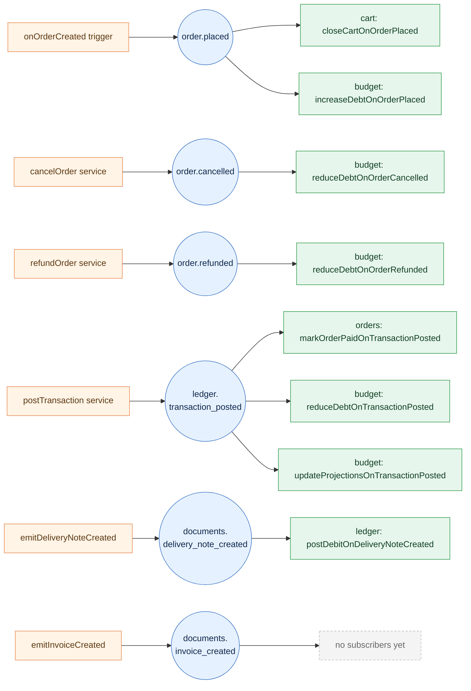

# Event system

`functions/src/platform/eventBus`

Modules talk to each other through **stored events**, not direct function calls.
A producer atomically writes the business data **and** an event document inside
the same Firestore transaction; a Firestore `onDocumentCreated` trigger then
delivers that event to every subscriber. The bus runs entirely on Firestore —
no Pub/Sub topic to manage, no separate message broker.

:::tip Why an event bus
- **Atomicity** — the business write and the event are committed together.
  If the write rolls back, no one sees a phantom event.
- **Decoupling** — `cart` doesn't import `orders` to close a cart on checkout;
  it subscribes to `order.placed`.
- **Replayable** — every emitted event is a Firestore document under
  `{companyId}/{storeId}/events`. You can audit, replay, or backfill.
:::

## Flow at a glance

Emitters (orange) write events (blue). The Firestore trigger fans out to every
subscriber (green) for that event type.



## How the bus works

### Storage

Events live under the tenant-scoped collection:

```
{companyId}/{storeId}/events/{eventId}
```

Every event is a `StoredEvent` envelope (see
`platform/eventBus/types.ts`) with a `type`, `payload`, `source`, `actorId`,
`correlationId`, and `createdAt` (epoch millis).

### Emitting

There are two ways to emit, depending on whether you already hold a Firestore
transaction:

| API           | When to use                                                                 |
| ------------- | --------------------------------------------------------------------------- |
| `emit(tx, e)` | You're already inside a `runTransaction`. The event is atomic with your write. |
| `emitEvent(e)` | Standalone — wraps the emit in its own transaction. Failures are logged, not thrown, so they never break the parent flow. |

The canonical pattern is `emit(tx, …)` inside the writer that owns the data.
Example — `ledger/services/postTransaction.ts` writes the transaction doc and
the `ledger.transaction_posted` event in the same `runTransaction`. If either
write fails, both roll back.

### Subscribing

A subscriber is a `subscribe({ name, type, payloadSchema }, handler)` export
under `modules/{x}/subscribers/`. Under the hood it's a v2
`onDocumentCreated` trigger on `{companyId}/{storeId}/events/{id}` — every
event document fans out to every subscriber, and each one filters by
`event.type === options.type`.

Each subscriber must use a **unique `name`** — it's the dedup key for retries
and the prefix for ledger writes (`evt_{subscriberName}_{eventId}`).

### Retries & dead-letter

The subscribe wrapper turns the v2 trigger's `retry: true` into a bounded
delivery loop:

- Attempts are tracked under
  `{companyId}/{storeId}/eventBusAttempts/{subscriberName}_{eventId}`.
- Up to **5 attempts** (`MAX_ATTEMPTS` in `subscribe.ts`). Each error is
  appended (truncated to 1KB so the attempts doc stays small).
- On attempt 5 the event is moved to
  `{companyId}/{storeId}/eventBusDeadLetter/{subscriberName}_{eventId}` with
  the full attempt history, and the attempts doc is cleared.
- A successful handler also clears the attempts doc — that's the
  steady-state path.

### Idempotency

Subscribers should be idempotent because Firestore delivers
**at-least-once**. Two patterns are in use:

- **Ledger writes** — `postTransaction` derives the doc id from a
  deterministic `dedupKey` (`evt_{subscriberName}_{eventId}`). A duplicate
  delivery hits `ALREADY_EXISTS` and is treated as a no-op.
- **Per-business-key markers** — `reduceDebtOnOrderReversed` uses
  `order_reversal_{orderId}` so that even if both `order.cancelled` AND
  `order.refunded` fire for the same order, only the first one applies.

## Event catalog

| Event                                     | Emitted by                                                | Subscribers                                                                                              |
| ----------------------------------------- | --------------------------------------------------------- | -------------------------------------------------------------------------------------------------------- |
| `order.placed`                            | `orders/triggers/onOrderCreated.ts`                       | `cart: closeCartOnOrderPlaced` · `budget: increaseDebtOnOrderPlaced`                                     |
| `order.cancelled`                         | `orders/services/cancelOrder.ts`                          | `budget: reduceDebtOnOrderCancelled`                                                                     |
| `order.refunded`                          | `orders/services/refundOrder.ts`                          | `budget: reduceDebtOnOrderRefunded`                                                                      |
| `ledger.transaction_posted`               | `ledger/services/postTransaction.ts`                      | `orders: markOrderPaidOnTransactionPosted` · `budget: reduceDebtOnTransactionPosted` · `budget: updateProjectionsOnTransactionPosted` |
| `documents.delivery_note_created`         | `documents/internal/emitDeliveryNoteCreated.ts`           | `ledger: postDebitOnDeliveryNoteCreated`                                                                 |
| `documents.invoice_created`               | `documents/internal/emitInvoiceCreated.ts`                | _none yet_                                                                                               |

## Per-event detail

### `order.placed`

**Emitted from** `orders/triggers/onOrderCreated.ts` — the `onOrderCreated`
Firestore trigger fires as soon as a new order doc is written by the
storefront/admin.

**Payload** (`OrderPlacedPayload` in `orders/events.ts`):

| Field             | Type       | Notes                                              |
| ----------------- | ---------- | -------------------------------------------------- |
| `orderId`         | string     | Required.                                          |
| `cartId`          | string?    | Cart the order was placed from (used by `cart`).   |
| `total`           | number?    | Order total (shekels).                             |
| `status`          | string?    |                                                    |
| `paymentType`     | string?    | `manual`, `hyp_direct`, `hyp_j5_auth`, …           |
| `organizationId`  | string?    | B2B only — drives debt accrual.                    |
| `customerEmail`   | string?    |                                                    |

**Subscribers**

- `cart: closeCartOnOrderPlaced` (`cart/subscribers/closeCartOnOrderPlaced.ts`) — closes the cart referenced by `cartId` so the customer starts fresh.
- `budget: increaseDebtOnOrderPlaced` (`budget/subscribers/increaseDebtOnOrderPlaced.ts`) — accrues outstanding debt for the placing organization (B2B path).

### `order.cancelled`

**Emitted from** `orders/services/cancelOrder.ts` when an admin transitions
the order to `cancelled`.

**Payload** (`OrderCancelledPayload`): `orderId`, `organizationId?`,
`clientId?`, `total?`, `reason?`, `cancelledAt?`, `cancelledBy?`.

**Subscribers**

- `budget: reduceDebtOnOrderCancelled` (`budget/subscribers/reduceDebtOnOrderReversed.ts`) — reverses the original debt by reading the matching `debt_increase` budget record. Per-order dedup means `cancelled` AND `refunded` together still reverse exactly once.

### `order.refunded`

**Emitted from** `orders/services/refundOrder.ts` when an admin marks the
order refunded.

**Payload** (`OrderRefundedPayload`): `orderId`, `organizationId?`,
`clientId?`, `refundedAmount?`, `originalTotal?`, `reason?`, `refundedAt?`,
`refundedBy?`.

**Subscribers**

- `budget: reduceDebtOnOrderRefunded` (`budget/subscribers/reduceDebtOnOrderReversed.ts`) — same shared handler as `order.cancelled`, same `order_reversal_{orderId}` dedup key.

### `ledger.transaction_posted`

**Emitted from** `ledger/services/postTransaction.ts` inside the same
Firestore transaction that writes the `transactions` doc. Atomic guarantee:
if the transaction commits, the event is guaranteed emitted; if not, no
event leaks.

**Payload** (`TransactionPostedPayload` in `ledger/events.ts`):

| Field          | Type                                              | Notes                                          |
| -------------- | ------------------------------------------------- | ---------------------------------------------- |
| `transactionId`| string                                            | Required.                                      |
| `kind`         | `credit` \| `debit`                               | Defaults to `credit` for legacy events.        |
| `type`         | one of 8 ledger types                             | See [Ledger transaction types](/modules/ledger#transaction-types). |
| `amount`       | integer agorot, positive                          |                                                |
| `direction`    | `in` \| `out` \| `none`                           | `none` = debit accrual (no cash movement).     |
| `reference`    | `{ type: order \| refund \| adjustment, id }`?    |                                                |
| `payer`        | `{ organizationId?, clientId?, billingAccountId? }`? | Forwarded so subscribers don't re-read the transaction. |

**Subscribers**

- `orders: markOrderPaidOnTransactionPosted` (`orders/subscribers/markOrderPaidOnTransactionPosted.ts`) — flips the related order's `paymentStatus` when a credit transaction lands.
- `budget: reduceDebtOnTransactionPosted` (`budget/subscribers/reduceDebtOnTransactionPosted.ts`) — applies `credit + direction: "in"` against the payer's outstanding debt.
- `budget: updateProjectionsOnTransactionPosted` (`budget/subscribers/updateProjectionsOnTransactionPosted.ts`) — refreshes budget projections.

:::note Legacy filter
Legacy subscribers act only on `direction: "in"`, so `none` debits (delivery
notes, invoices, credit notes, adjustments) are safely ignored.
:::

### `documents.delivery_note_created`

**Emitted from** `documents/internal/emitDeliveryNoteCreated.ts` after a
delivery note is created.

**Payload** (`DocumentDeliveryNoteCreatedPayload`): `orderId`,
`deliveryNoteId?`, `deliveryNoteNumber?`, `organizationId?`, `clientId?`,
`billingAccountId?`, `total?` (shekels), `vat?` (shekels), `currency?`,
`createdAt?` (epoch millis), `createdBy?`.

**Subscribers**

- `ledger: postDebitOnDeliveryNoteCreated` (`ledger/subscribers/postDebitOnDeliveryNoteCreated.ts`) — posts a `delivery_note` debit transaction (accrual on credit terms).

### `documents.invoice_created`

**Emitted from** `documents/internal/emitInvoiceCreated.ts` after an invoice
is created (with `deliveryNoteNumber` set when it was created from a
delivery note).

**Payload** (`DocumentInvoiceCreatedPayload`): `orderId`, `invoiceNumber`,
`invoiceDocUuid`, `amount` (integer agorot), `companyId`, `storeId`,
`deliveryNoteNumber?`, `organizationId?`, `allocationNumber?`.

**Subscribers** — _none yet_. The event is emitted for future consumers
(e.g. tax reporting, customer email).

## Conventions

- **Define payloads with Zod.** Every event has a Zod schema in
  `modules/{x}/events.ts`. The subscriber's `payloadSchema` is the same
  schema — invalid payloads fail-closed inside the subscribe wrapper
  (logged, not retried).
- **Event types live next to the module that owns them.** Never put an
  event type in a consumer module.
- **No `emit*.ts` wrapper services.** Inline `emitEvent(…)` at the call
  site. The two `documents/internal/emit…` files are the exception because
  they encapsulate parameter shaping shared by multiple callers.
- **One subscriber, one file, one job.** Subscriber filenames are
  `{verb}On{EventName}.ts` and each subscriber owns its dedup key. Multiple
  effects of the same event = multiple subscribers, not one fat handler.
