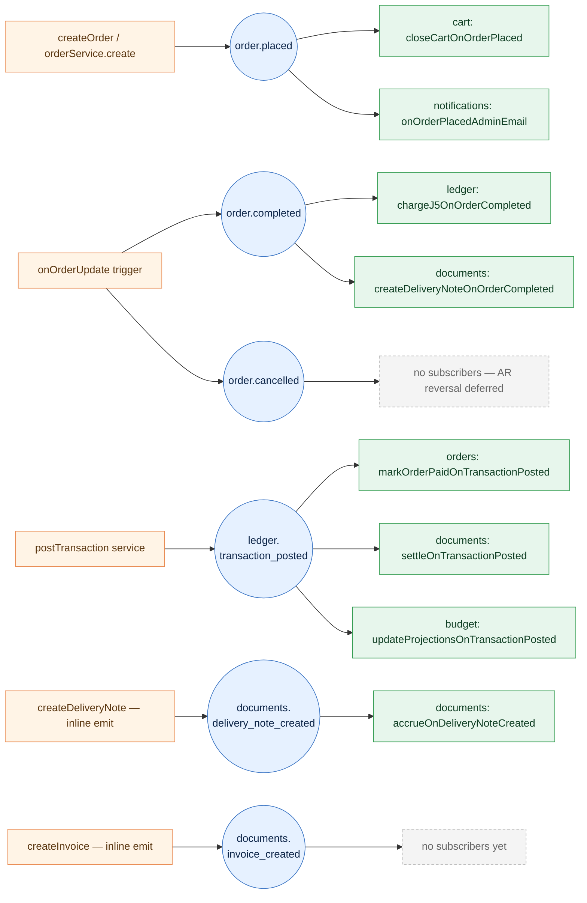

# Event system

`functions/src/platform/eventBus`

Modules talk to each other through **stored events**, not direct function calls.
A producer atomically writes the business data **and** an event document inside
the same Firestore transaction; a Firestore `onDocumentCreated` trigger then
delivers that event to every subscriber. The bus runs entirely on Firestore —
no Pub/Sub topic to manage, no separate message broker.

:::tip Why an event bus
- **Atomicity** — the business write and the event are committed together.
  If the write rolls back, no one sees a phantom event.
- **Decoupling** — `cart` doesn't import `orders` to close a cart on checkout;
  it subscribes to `order.placed`.
- **Replayable** — every emitted event is a Firestore document under
  `{companyId}/{storeId}/events`. You can audit, replay, or backfill.
:::

## Flow at a glance

Emitters (orange) write events (blue). The Firestore trigger fans out to every
subscriber (green) for that event type.



:::info Money flow after the `ar-organization-balance` refactor
The **ledger** is pure cash (real money in/out). **Accounts-receivable** (B2B
debt) lives in the **documents** module:

- Debt is accrued **at delivery-note creation** (`documents: accrueOnDeliveryNoteCreated`),
  **not** at order placement — `budget: increaseDebtOnOrderPlaced` was removed.
- Debt is settled when real money is received
  (`documents: settleOnTransactionPosted` on `ledger.transaction_posted`).
- `budget` now only projects **revenue rollups** from cash.

See the [Documents](/modules/documents) and [Budget](/modules/budget) module pages.
:::

## How the bus works

### Storage

Events live under the tenant-scoped collection:

```
{companyId}/{storeId}/events/{eventId}
```

Every event is a `StoredEvent` envelope (see
`platform/eventBus/types.ts`) with a `type`, `payload`, `source`, `actorId`,
`correlationId`, and `createdAt` (epoch millis).

### Emitting

There are two ways to emit, depending on whether you already hold a Firestore
transaction:

| API           | When to use                                                                 |
| ------------- | --------------------------------------------------------------------------- |
| `emit(tx, e)` | You're already inside a `runTransaction`. The event is atomic with your write. |
| `emitEvent(e)` | Standalone — wraps the emit in its own transaction. Failures are logged, not thrown, so they never break the parent flow. |

The canonical pattern is `emit(tx, …)` inside the writer that owns the data.
Example — `ledger/services/postTransaction.ts` writes the transaction doc and
the `ledger.transaction_posted` event in the same `runTransaction`. If either
write fails, both roll back.

### Subscribing

A subscriber is a `subscribe({ name, type, payloadSchema }, handler)` export
under `modules/{x}/subscribers/`. Under the hood it's a v2
`onDocumentCreated` trigger on `{companyId}/{storeId}/events/{id}` — every
event document fans out to every subscriber, and each one filters by
`event.type === options.type`.

Each subscriber must use a **unique `name`** — it's the dedup key for retries
and the prefix for ledger writes (`evt_{subscriberName}_{eventId}`).

### Retries & dead-letter

The subscribe wrapper turns the v2 trigger's `retry: true` into a bounded
delivery loop:

- Attempts are tracked under
  `{companyId}/{storeId}/eventBusAttempts/{subscriberName}_{eventId}`.
- **Claim-first:** the attempt count is persisted **before** the handler runs,
  not in the `catch` after. So a hard crash (e.g. an OOM that kills the process
  before any `catch` can run) still counts — the `received` log shows the true
  attempt number, and dead-lettering still fires. On the next delivery, if the
  budget is already exhausted, the event is dead-lettered at the top **without
  re-running the handler** (important for handlers with external side effects).
- Default **5 attempts** (`MAX_ATTEMPTS`), overridable per subscriber via the
  `maxAttempts` option — e.g. `createDeliveryNoteOnOrderCompleted` sets
  `maxAttempts: 1` (one shot at the external EZcount call, then dead-letter).
  Each error is appended (truncated to 1KB).
- On the final failed attempt the event is moved to
  `{companyId}/{storeId}/eventBusDeadLetter/{subscriberName}_{eventId}` with the
  full attempt history, and the attempts doc is cleared.
- A successful handler clears the attempts doc — the steady-state path.

### Idempotency

Subscribers should be idempotent because Firestore delivers
**at-least-once**. Two patterns are in use:

- **Ledger writes** — `postTransaction` derives the doc id from a
  deterministic `dedupKey` (`evt_{subscriberName}_{eventId}`). A duplicate
  delivery hits `ALREADY_EXISTS` and is treated as a no-op.
- **Per-business-key markers** — AR entries use a stable business id rather
  than the event id: accrual = `dn_{deliveryNoteId}` (one entry per delivery
  note), settlement = `settle_{transactionId}` (one entry per payment, so a
  re-delivered `transaction_posted` cannot double-settle).

## Event catalog

| Event                             | Emitted by                                                | Subscribers                                                                                                          |
| --------------------------------- | --------------------------------------------------------- | ------------------------------------------------------------------------------------------------------------------- |
| `order.placed`                    | `orders/services/orderService.ts` (`create`, in the create txn) | `cart: closeCartOnOrderPlaced` · `notifications: onOrderPlacedAdminEmail`                                      |
| `order.completed`                 | `orders/triggers/onOrderUpdate.ts` (inline, on `→ completed`)   | `ledger: chargeJ5OnOrderCompleted` (J5 capture) · `documents: createDeliveryNoteOnOrderCompleted` (external DN)  |
| `order.cancelled`                 | `orders/triggers/onOrderUpdate.ts` (inline, on `→ cancelled`)   | _none_ — AR reversal deferred (see note below)                                                                  |
| `ledger.transaction_posted`       | `ledger/services/postTransaction.ts`                      | `orders: markOrderPaidOnTransactionPosted` · `documents: settleOnTransactionPosted` · `budget: updateProjectionsOnTransactionPosted` |
| `documents.delivery_note_created` | `appApi/index.ts` (`createDeliveryNote`, inline emit)     | `documents: accrueOnDeliveryNoteCreated`                                                                             |
| `documents.invoice_created`       | `documents/api/createInvoice.ts` (inline emit)            | _none_ (billing milestone only — no AR effect)                                                                      |

:::warning Orphaned event (deferred work)
`order.cancelled` is still emitted but currently has **no subscribers** — the
old `budget` reversal handlers were removed with the AR refactor and a
documents-side reversal hasn't been built yet. Today a cancelled order that was
already fulfilled (delivery note issued) **leaves its AR accrual in place**.
This is a known, tracked follow-up. (`order.refunded` no longer exists — it was
removed from `OrderEventTypes`.)
:::

## Per-event detail

### `order.placed`

**Emitted from** `orders/services/orderService.ts` (`create`) — written **inside
the create transaction** by the `createOrder` callable, atomic with the order
doc (the old `onOrderCreated` trigger was removed).

**Payload** (`OrderPlacedPayload` in `orders/events.ts`):

| Field             | Type       | Notes                                              |
| ----------------- | ---------- | -------------------------------------------------- |
| `orderId`         | string     | Required.                                          |
| `cartId`          | string?    | Cart the order was placed from (used by `cart`).   |
| `total`           | number?    | Order total (shekels).                             |
| `status`          | string?    |                                                    |
| `paymentType`     | string?    | `manual`, `hyp_direct`, `hyp_j5_auth`, …           |
| `organizationId`  | string?    | B2B only.                                          |
| `customerEmail`   | string?    |                                                    |

**Subscribers**

- `cart: closeCartOnOrderPlaced` (`cart/subscribers/closeCartOnOrderPlaced.ts`) — closes the cart referenced by `cartId` so the customer starts fresh.
- `notifications: onOrderPlacedAdminEmail` (`notifications/subscribers/orderPlacedAdminEmail.tsx`) — emails the store owner about the new order.

:::note Debt no longer accrues here
Before the AR refactor, `budget: increaseDebtOnOrderPlaced` created B2B debt the
moment an order was placed. That subscriber was **removed** — debt now accrues
later, at **delivery-note creation**, on the fulfilled amount (orders change
after picking/editing/cancelling, so placement was the wrong anchor).
:::

### `order.completed`

**Emitted from** `orders/triggers/onOrderUpdate.ts` (inline) when the order
transitions `status → completed` (`before.status !== "completed" && after.status === "completed"`).

**Payload** (`OrderCompletedPayload` in `orders/events.ts`): `orderId`,
`paymentType?`.

**Subscribers** — two, each scoped to a different `paymentType` (disjoint, exactly one acts per order):

- `ledger: chargeJ5OnOrderCompleted` (`ledger/subscribers/chargeJ5OnOrderCompleted.ts`) — for **`paymentType: j5`** orders not already paid, captures the J5 hold (`internalChargeJ5Order` → `hyp_capture`). Re-reads the authoritative order and guards on `paymentStatus === "completed"` to avoid re-capture. See [Payment flows → Scenario 1](./payment-flows).
- `documents: createDeliveryNoteOnOrderCompleted` (`documents/subscribers/createDeliveryNoteOnOrderCompleted.ts`) — for **`paymentType: external`** orders, auto-creates the delivery note (`appApi.documents.createDeliveryNote`), which then emits `documents.delivery_note_created` → AR accrual. Idempotency guard on `order.deliveryNote`/`ezDeliveryNote`; `maxAttempts: 1`; runs at `memory: 1GiB` (Chromium PDF rendering). See [Payment flows → Scenario 3](./payment-flows).

So **completing the order is the trigger for the next step in both flows** — a J5 capture for `j5`, a delivery note for `external`. The two subscribers handle disjoint payment types, so exactly one fires per order.

### `order.cancelled`

**Emitted from** `orders/triggers/onOrderUpdate.ts` (inline) when the order
transitions `status → cancelled`.

**Payload** (`OrderCancelledPayload`): `orderId`, `organizationId?`,
`clientId?`, `total?`, `reason?`, `cancelledAt?`, `cancelledBy?`.

**Subscribers** — _none_. AR reversal on cancellation is a deferred follow-up
(see the orphaned-events warning above).

### `ledger.transaction_posted`

**Emitted from** `ledger/services/postTransaction.ts` inside the same
Firestore transaction that writes the `transactions` doc. Atomic guarantee:
if the transaction commits, the event is guaranteed emitted; if not, no
event leaks.

**Payload** (`TransactionPostedPayload` in `ledger/events.ts`):

| Field          | Type                                              | Notes                                          |
| -------------- | ------------------------------------------------- | ---------------------------------------------- |
| `transactionId`| string                                            | Required.                                      |
| `type`         | `manual` \| `hyp_direct` \| `hyp_j5_auth` \| `hyp_capture` | Cash only — see [Ledger transaction types](/modules/ledger#transaction-types). |
| `amount`       | integer agorot, positive                          |                                                |
| `direction`    | `in` \| `out`                                     | `in` = received, `out` = refund. (No `none` — the ledger is pure cash.) |
| `reference`    | `{ type: order \| refund \| adjustment, id }`?    |                                                |
| `payer`        | `{ organizationId?, clientId?, billingAccountId? }`? | Routing hint; AR settlement re-reads the stored transaction. |

**Subscribers**

- `orders: markOrderPaidOnTransactionPosted` (`orders/subscribers/markOrderPaidOnTransactionPosted.ts`) — flips the related order's `paymentStatus` when a payment lands.
- `documents: settleOnTransactionPosted` (`documents/subscribers/settleOnTransactionPosted.ts`) — reduces a B2B org's AR. Acts only on **received-money** types (`hyp_capture`, `hyp_direct`, `manual`) with `direction: "in"` and a `payer.organizationId`; re-reads the stored transaction (payload is a routing hint only). `hyp_j5_auth` (an authorization hold) and refunds are skipped.
- `budget: updateProjectionsOnTransactionPosted` (`budget/subscribers/updateProjectionsOnTransactionPosted.ts`) — updates the cash **revenue rollups** (revenue reporting only — no AR/debt).

### `documents.delivery_note_created`

**Emitted inline** by `createDeliveryNote` (`appApi/index.ts`) after a delivery
note is issued via EZcount and persisted on the order. No `emit*` wrapper.

**Payload** (`DocumentDeliveryNoteCreatedPayload`): `orderId`,
`deliveryNoteId?`, `deliveryNoteNumber?`, `organizationId?`, `clientId?`,
`billingAccountId?`, `total?` (shekels), `vat?` (shekels), `currency?`,
`createdAt?` (epoch millis), `createdBy?`.

**Subscribers**

- `documents: accrueOnDeliveryNoteCreated` (`documents/subscribers/accrueOnDeliveryNoteCreated.ts`) — accrues B2B AR (`organizationBalance`). Re-reads the server order doc for the authoritative org + amount; B2C (no org) is skipped. Dedup id = `dn_{deliveryNoteId}`.

### `documents.invoice_created`

**Emitted inline** by `createInvoice` (`documents/api/createInvoice.ts`) on the
single-DN flow (with `deliveryNoteNumber` set when created from a delivery
note). No `emit*` wrapper.

**Payload** (`DocumentInvoiceCreatedPayload`): `orderId`, `invoiceNumber`,
`invoiceDocUuid`, `amount` (integer agorot), `companyId`, `storeId`,
`deliveryNoteNumber?`, `organizationId?`, `allocationNumber?`.

**Subscribers** — _none_. An invoice is a billing milestone with **no AR
effect** (debt was already accrued at the delivery note). Intended future
consumers: tax reporting, customer email.

## Conventions

- **Define payloads with Zod.** Every event has a Zod schema in
  `modules/{x}/events.ts`. The subscriber's `payloadSchema` is the same
  schema — invalid payloads fail-closed inside the subscribe wrapper
  (logged, not retried).
- **Event types live next to the module that owns them.** Never put an
  event type in a consumer module.
- **No `emit*.ts` wrapper services.** Inline `emitEvent(…)` at the call site
  (e.g. `createDeliveryNote` in `appApi/index.ts`, `createInvoice` in the
  documents module). The former `documents/internal/emitDeliveryNoteCreated.ts`
  and `emitInvoiceCreated.ts` wrappers were removed.
- **One subscriber, one file, one job.** Subscriber filenames are
  `{verb}On{EventName}.ts` and each subscriber owns its dedup key. Multiple
  effects of the same event = multiple subscribers, not one fat handler.
