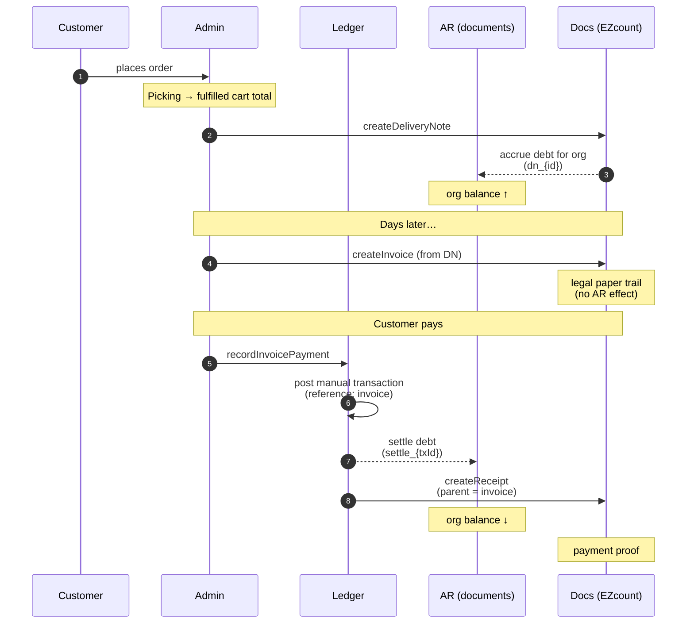

# Money & documents

How cash, receivables, and legal paper trails fit together. This is the
**conceptual** layer — for event wiring and code locations see the
[Event system](./event-system) page and individual module pages.

## Three separate concepts

The system deliberately keeps three things apart:

| Concept | What it tracks | Lives in | Mutable? |
| --- | --- | --- | --- |
| **Cash** | Real money in / out | `ledger` module | Append-only |
| **Debt (AR)** | What each org owes the store right now | `documents` module | Recalculated from accruals + settlements |
| **Documents** | Legal paper trail (DN / invoice / receipt) | `documents` module + EZcount | Created once, immutable |

The same payment touches all three but for different reasons:

- **Cash** says "I got ₪1,000 today"
- **Debt** says "Org X now owes ₪1,000 less"
- **Documents** says "Here's the receipt PDF proving it"

A bug in one doesn't corrupt the others. You can audit each independently.

## The full lifecycle

A typical B2B credit-terms order:



Notice that **debt moves at exactly two moments**: at delivery-note creation
(accrual) and at payment (settlement). Invoice creation is a paper milestone
— it does not change the balance.

## The Ledger — pure cash

`functions/src/modules/ledger`

Every successful cash event is a single append-only `Transaction` row.
There is no `status` field, no updates — only new facts. If a write fails,
nothing is recorded.

**Source-of-truth rule**: any number that needs to be summed (revenue,
total paid, refunds…) is summed from `transactions`. Never from a derived
cache.

### Transaction types

| Type | Family | When |
| --- | --- | --- |
| `manual` | credit | Admin recorded external payment (cash / check / transfer / credit card) |
| `hyp_direct` | credit | HYP direct payment link completed |
| `hyp_j5_auth` | credit | HYP J5 authorization (hold, not captured yet) |
| `hyp_capture` | credit | J5 hold captured server-side |
| `delivery_note` | debit | Issued on credit terms (accrual, no cash) |
| `invoice` | debit | Issued on credit terms (accrual, no cash) |
| `credit_note` | debit | Refund / credit (accrual reversal) |
| `adjustment` | debit | Manual balance adjustment |

**Direction**: `in` (money received), `out` (refund issued), `none` (accrual
debit — no cash moved).

### Idempotency

Every transaction has a **deterministic doc id** derived from a
`dedupKey`. Replays of the same event hit `ALREADY_EXISTS` and no-op:

| Source | Dedup key |
| --- | --- |
| `subscriber` | `evt_{subscriberName}_{eventId}` |
| `api` | `idem_{idempotencyKey}` (client-supplied) |
| `hyp_result` | `hyp_{verifiedHypTransactionId}` |
| `system` | auto-generated |

## Accounts Receivable — what each org owes

`functions/src/modules/documents` (post `ar-organization-balance` refactor)

The AR ledger is a parallel append-only log of two event types:

| Type | When | Effect |
| --- | --- | --- |
| **Accrual** | Delivery note is created | Org's open balance goes up |
| **Settlement** | A cash transaction is posted | Org's open balance goes down |

Per-org balance is the sum of accruals minus the sum of settlements. A
nightly reconciliation job verifies the running balance against the AR
log to catch drift.

### Why DN-time accrual (not order-time, not invoice-time)

- **Order placement** is too early — orders can be cancelled or partially
  fulfilled. Picking can drop items as missing.
- **Invoice creation** is too late — by the time the invoice is issued,
  goods have already changed hands and the customer already owes the
  money.
- **Delivery note** = goods physically left the warehouse. That's the
  moment the customer owes you.

### Why settlement at cash time

Settlement fires on `ledger.transaction_posted` for any **received-money**
type (`manual`, `hyp_direct`, `hyp_capture`). The `hyp_j5_auth` type is
explicitly excluded — it's an authorization hold, not received money. The
later `hyp_capture` is what settles.

A settlement entry is keyed `settle_{transactionId}` — one transaction can
settle at most once regardless of how many times the event re-delivers.

### What does NOT touch AR

- **Invoice creation** — milestone, not money movement
- **Refund** (`direction: "out"`) — current behavior is to NOT reverse AR;
  refunds are handled as new credit notes (see "Deferred" below)
- **Order cancellation / refund events** — AR reversal currently deferred,
  tracked as orphaned events in [Event system](./event-system)

## Documents — the paper trail

`functions/src/modules/documents` + `services/ezCountService`

EZcount issues the formal Israeli tax documents. Each document has its own
type code and purpose:

| Type | EZcount code | Hebrew | Purpose |
| --- | --- | --- | --- |
| Delivery note | 200 | תעודת משלוח | Goods left the warehouse |
| Tax invoice | 305 | חשבונית מס | Formal "you owe me X" |
| Receipt | 400 | קבלה | Formal "I received X" |
| Invoice-receipt | 320 | חשבונית מס קבלה | Combined (cash sales) |
| Credit invoice | 330 | חשבונית זיכוי | Refund / credit |
| Proforma | 300 | חשבונית עסקה | Pre-invoice estimate |

### How they link

Documents are **chained via `parent`** on EZcount's side. The chain typically
looks like:

```
delivery note  →  invoice  →  receipt
   (#70123)    →  (#70456)  →  (#70789)
```

Each subsequent doc carries the previous doc's `doc_uuid` as `parent`. This
gives EZcount (and the tax authority) a clean lineage.

### Where they're stored

EZcount hosts the PDFs. We store the EZcount response shape (uuid, PDF link,
doc_number, calculatedData) **on the order document** at:

| Field on `o` | What it is |
| --- | --- |
| `o.deliveryNote` / `o.ezDeliveryNote` | Delivery note record |
| `o.invoice` / `o.ezInvoice` | Invoice record |
| `o.ezReceipt` | Receipt record |
| `o.invoicePaidAt` | Epoch millis — set when admin records full payment |

So every document related to an order lives **on that order**, not in
separate collections. Queries start from "which order?".

### Allocation numbers (חשבונית ישראל)

Israeli law requires an allocation number (`allocationNumber`) on tax
invoices ≥ ₪5,000. The `createInvoice` endpoint enforces this at the
boundary — invoices below the threshold skip the requirement, invoices at
or above it reject without an allocation number. Allocations are issued by
the ITA (Israeli Tax Authority) and supplied by the admin.

## Conventions

### Money

- **Storage**: integer **agorot** (₪1 = 100 agorot). Never floats for stored
  money.
- **Display**: convert to shekels at the UI boundary.
- **Legacy data exception**: pre-2026 records (`cart.cartTotal`, balances on
  older orders) are stored as shekels — code that touches both old and new
  data must mirror the existing display path. New money fields are agorot.
- **HYP boundary**: HYP API expects shekels — convert at the call site.
- **Currency**: always `"ILS"`. No multi-currency.

### Time

- **Storage**: epoch **millis** (`Date.now()`-style).
- **EZcount boundary**: format as `DD/MM/YYYY` at the call site.

### Tenant scoping

Every Firestore path is `{companyId}/{storeId}/...`. Build paths only with
`FirebaseAPI.firestore.getPath` — never hand-build, never use root
collections. The AR and ledger data is **never** shared across stores or
companies.

### Idempotency keys

| Source | Convention |
| --- | --- |
| Subscriber | `evt_{subscriberName}_{eventId}` |
| Admin manual transaction | `idem_{idempotencyKey}` (client-supplied) — e.g. `inv-pay-{orderId}` |
| HYP capture | `hyp_{verifiedHypTransactionId}` |
| AR accrual | `dn_{deliveryNoteId}` |
| AR settlement | `settle_{transactionId}` |

The keys are **deterministic** — re-delivery and double-clicks both no-op
cleanly.

## What this is not

- **Not a general accounting system** — there's no chart of accounts, no
  P&L, no balance sheet. Just AR (debtors) and cash.
- **Not multi-currency** — Israel only, ILS only.
- **Not double-entry bookkeeping** — single-entry cash log + single-entry
  AR log.
- **Not a system of record for products / orders** — those have their own
  modules. Money modules consume their facts, don't dictate them.

## Related

- [Event system](./event-system) — the wiring that ties the modules together
- [Ledger module](/modules/ledger) — concrete code surface
- [Customer Debts admin page](/admin/pages/customer-debts) — the page that surfaces open invoices and records payments
