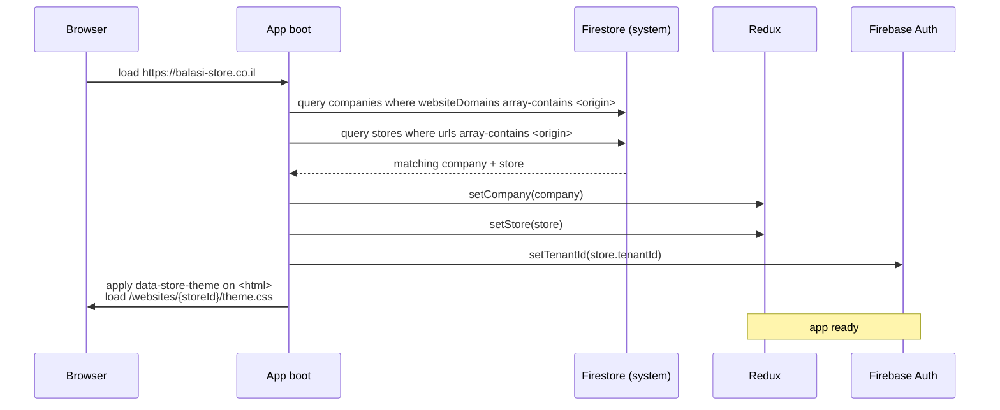

# Multi-tenant

One codebase serves many storefronts. Each storefront has its own domain,
its own customers, its own products, its own ledger, and its own
admin team. Data is never shared across tenants — leakage is the
single most dangerous bug class in the system.

## Why this matters

Every storefront on the platform — balasi-store.co.il, pecanis.co.il,
tester-store, future stores — runs the **same React app** and the **same
Cloud Functions backend**. The codebase ships once; tenants are resolved
at runtime.

The alternative (a separate codebase per store) was rejected because:

- New features ship to every store at once
- A bug fix touches one place, not N
- Owner-facing screens (admin app, settings) are identical across stores

The trade-off: every Firestore read, every Algolia query, every Cloud
Function call must be **tenant-scoped**. There is no inherent isolation —
isolation is enforced in code at every layer.

## The hierarchy

```
Company
  └─ Store
       └─ data (orders, products, organizations, transactions, …)
```

| Concept | Examples | Why it exists |
| --- | --- | --- |
| **Company** | `balasistore_company`, `tester_company` | Legal entity. One tax ID, one accounting account. Can theoretically own multiple stores. |
| **Store** | `balasistore_store`, `tester_store` | A storefront. Has its own domain(s), products, customers, settings, EZcount API key, HYP credentials. |

In practice today it's almost always **1 company → 1 store**, but the
schema supports multiple stores per company.

## Resolution — how a URL becomes a tenant

When a customer (or admin) opens the app at `https://balasi-store.co.il`,
this happens in `apps/store/src/app/init.ts`:



Key points:

- **One domain → one store**. The `websiteDomains` and `urls` arrays both
  contain the current `window.location.origin`. A store can have multiple
  domains; a domain belongs to exactly one store.
- **Resolution happens once per session**. Both company and store sit in
  Redux for the lifetime of the app.
- **Firebase Auth tenant** is set immediately. All subsequent auth
  operations (sign in, custom claims) happen inside that tenant. Customers
  of store A literally cannot sign in at store B's domain.
- **Theme + per-store UI** load based on `store.id`. See [UI customization](#ui-customization) below.

If no company or store matches the origin (e.g. wrong DNS, dev env not
configured), the app boots with `appReady = true` but no tenant — an error
log is written and the user sees an unconfigured shell.

## Data isolation — the Firestore rule

**Every** tenant-scoped Firestore path is built with one helper:

```ts
FirebaseAPI.firestore.getPath({
  companyId,
  storeId,
  collectionName: "orders",
  id: orderId,
})
// → balasistore_company/balasistore_store/orders/{orderId}
```

Never hand-build a path. Never use a root collection for tenant data.

The shape `{companyId}/{storeId}/{collectionName}/{docId}` is enforced
everywhere: orders, products, organizations, transactions, AR records,
budget records, events — all live under the tenant prefix.

### Exceptions (the only ones)

| Path | Why |
| --- | --- |
| `companies/{companyId}` | The company registry itself — lookup before tenant is known |
| `STORES/{storeId}` | Store metadata — lookup before tenant is known |
| `STORES/{storeId}/private/data` | Secrets (EZcount key, HYP credentials) — admin-only |
| `profiles/{uid}` | User profiles — single shared identity across stores a user has access to |

Anything else under the root is a bug.

### Lookup-by-opaque-token

When a caller has a token (e.g. a public payment link) but no tenant context yet, use `collectionGroup`:

```ts
db.collectionGroup("paymentLinks").where("token", "==", token).limit(1).get();
```

This searches across all tenants. The doc itself carries `companyId` and `storeId`, so once found, every subsequent read returns to the scoped path. **Do NOT promote the collection to root just to make a lookup easier.**

## Auth — tenant-scoped identity

Firebase Auth's [multi-tenancy](https://firebase.google.com/docs/auth/admin/multi-tenancy) feature is used per **store** (not per company). Every store has a unique `tenantId` stored on `store.tenantId`. Customers and admins of one store cannot sign in to another store — Firebase rejects it at the auth layer.

### Custom claims

When a user is given admin access to a store, the backend stamps custom claims on their token:

```ts
{
  admin: true,
  companyId: "balasistore_company",
  storeId: "balasistore_store",
}
```

Every backend callable reads `companyId` / `storeId` from `auth.token`, **never** from client input. This is non-negotiable:

```ts
export const someAdminEndpoint = functionsV2.https.onCall(
  async (request) => {
    const { auth } = request;
    if (!auth?.token.admin) return { success: false, error: "Unauthorized" };

    const companyId = auth.token.companyId as string | undefined;
    const storeId   = auth.token.storeId as string | undefined;
    if (!companyId || !storeId) {
      return { success: false, error: "missing_token_claims" };
    }
    // …
  }
);
```

A client-supplied `companyId` or `storeId` is **never** trusted. If you accept one in a callable payload, you've created a tenant-escape vulnerability — see [Common pitfalls](#common-pitfalls).

## Search — Algolia filter rule

External search indexes (Algolia, Typesense, anything) do NOT inherit Firestore tenancy. Every search MUST pass an explicit tenant filter:

```ts
index.search(query, {
  filters: `storeId:${storeId} AND companyId:${companyId}`,
});
```

Always derive `storeId` + `companyId` from the entity you already hold (e.g. `order.storeId`, `order.companyId`) or the auth token — never from unscoped client input.

Forgetting this filter leaks every store's data to every other store. This is the second-most-dangerous bug class after Firestore path errors.

## UI customization

The React app ships one main flow but supports per-store overrides at three layers.

### Layer 1 — per-store components

`apps/store/src/websites/{storeId}/` contains store-specific implementations:

```
apps/store/src/websites/
  balasistore/       # store-specific design & layouts
    CartPage.tsx
    CheckoutLayout.tsx
    HomePage.tsx
    CatalogPage.tsx
    theme.css
    ...
  tester/
    thme.css
    ...
  default/           # fallback for any store without overrides
    DefaultProductCard.tsx
```

Pages decide which version to use via `ProductRender` / route-level switches:

```ts
const STORE_OVERRIDES = {
  balasistore_store: {
    catalogPage: lazy(() => import("src/websites/balasistore/CatalogPage")),
  },
};
const fallback = lazy(() => import("src/websites/default/DefaultCatalogPage"));
```

The decision key is `store.id` — pulled from Redux.

### Layer 2 — theme CSS

`ThemeRender` lazy-loads a per-store theme stylesheet:

```ts
balasistore_store: () => import("../../../websites/balasistore/theme.css"),
tester_store:      () => import("../../../websites/tester/thme.css"),
```

The CSS file defines CSS custom properties (`--accent`, `--brand-primary`, etc.) — every component reads those, so swapping the theme repaints the whole UI without component changes.

### Layer 3 — `data-store-theme` attribute

Set on `<html>` once at boot:

```html
<html data-store-theme="balasistore_store">
```

CSS can scope rules to a specific store when needed:

```css
[data-store-theme="balasistore_store"] .header { … }
```

This is rarely necessary — most variation goes through CSS custom properties — but it's there for store-specific exceptions.

## Dev environment — running a specific tenant

Domain-based resolution requires a real URL. For local development:

| Script | URL | Tenant |
| --- | --- | --- |
| `yarn workspace store dev:test` | http://localhost:5175 | `tester_company` / `tester_store` |
| `yarn workspace store dev:test2` | http://localhost:5176 | second test tenant |

The `tester_store` and `tester_company` documents in Firestore have `websiteDomains: ["http://localhost:5175"]` and `urls: ["http://localhost:5175"]` so the boot lookup matches.

**Do not** use `dev:balasistore` or `dev:pecanis` for local work — they point at real customer data. Use test stores only. (See the project's `CLAUDE.md` — this is a hard rule.)

The `.env.test` file carries default test-tenant constants (`VITE_STORE_ID=tester_store`, `VITE_COMPANY_ID=tester_company`) — these are mostly diagnostic; the actual resolution still happens via the Firestore domain lookup on boot.

## Common pitfalls

The biggest leakage risks. Treat each as a code-review blocker:

| Pitfall | What goes wrong | How to avoid |
| --- | --- | --- |
| Hand-built Firestore path | Misses the `{companyId}/{storeId}` prefix → reads/writes leak across tenants | Always use `FirebaseAPI.firestore.getPath`. Treat any string concatenation that produces a path as suspect. |
| Client-supplied `companyId` / `storeId` in callable payload | Caller can switch tenants by lying in the request | Read from `auth.token` only. Validate input schemas explicitly reject `companyId` / `storeId` fields. |
| Reference-id tenant check missing | Callable accepts e.g. `reference.id: orderId` but doesn't verify the order belongs to the caller's tenant | Add a `verifyXxxBelongsToTenant(id, companyId, storeId)` ownership check before any write. See `verifyInvoiceBelongsToTenant` in `postManualTransaction.ts` for the canonical pattern. |
| Algolia query without `storeId AND companyId` filter | Every store's results returned to every store | Audit every `index.search(...)` call. The filter is mandatory. |
| Root collection for tenant data | Bypasses tenant prefix entirely | Only the four documented root collections (`companies`, `STORES`, `STORES/{id}/private`, `profiles`) are allowed. Any new one is a red flag. |
| Promoting a collection-group lookup to a root collection | Same as above, but disguised as "the lookup needs to be fast" | Use `collectionGroup` queries instead — they work across tenants but the docs still carry tenant prefixes. |
| Using `request.data.companyId` for the path | Server trusts the client | Use `request.auth.token.companyId`. |

## Related

- [Event system](./event-system) — stored events live under `{companyId}/{storeId}/events/{id}` — same tenant rule
- [Money & documents](./money-and-documents) — ledger, AR, and EZcount records all tenant-scoped
- The project's root `CLAUDE.md` for the operational tenant rules and dev-store policy
