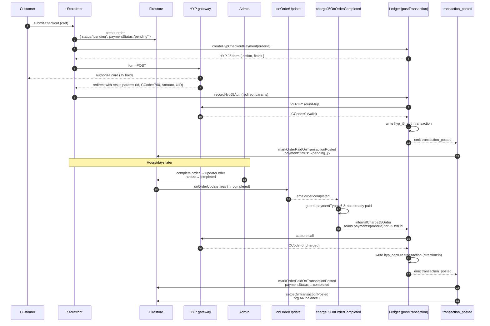
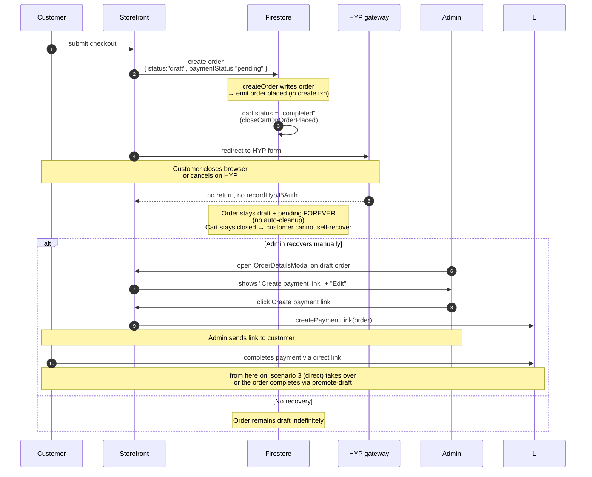
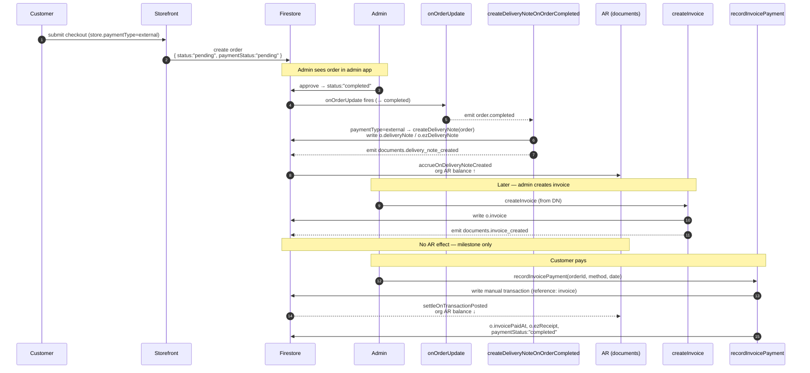

# Payment flows — end-to-end

The three checkout flows the platform supports, with the **exact** order
status, payment status, ledger writes, and document creation at each step.
Use this as a runbook when testing.

For module-level details see [Ledger](/modules/ledger). For the conceptual
separation between cash, AR and documents see [Money & documents](./money-and-documents).

## The orthogonal state model

Two fields on the order doc carry independent state:

| `status` (fulfillment lifecycle) | `paymentStatus` (payment lifecycle) |
| --- | --- |
| `draft` — checkout submitted, payment not finalized | `pending` — payment not started or not received |
| `pending` — payment OK or external, waiting for admin approval | `pending_j5` — J5 hold authorized, not yet captured |
| `processing` — admin approved, picking | `external` — cash / cheque / bank-transfer order |
| `in_delivery` — DN issued | `completed` — money in the ledger |
| `delivered` — handed off | `failed` — payment rejected by HYP |
| `completed` — final state | `refunded` |
| `cancelled` / `refunded` | |

The two are supposed to be orthogonal, but today the code partly conflates
them — `status === "draft"` is used as a stand-in for "not paid". A planned
refactor (see `todo.md`) will untangle this. For now, the table above is the
mental model; the runbook below tracks both values explicitly.

:::caution Known bug — `onOrderPaid` may revert paid orders
`apps/store/src/appApi/index.ts ~L1628` does an UNCONDITIONAL client write
that sets `status: "pending"` and `paymentStatus: "pending_j5"` on every load
of `OrderSuccessPage.tsx`. Re-opening or back-button to `/orderSuccess?…`
clobbers a `completed` order back to `pending`. Tracked in `todo.md` as
🔴 CRITICAL. **If you hit weird status reverts during testing, this is why.**
:::

## Scenario 1 — Normal J5 (deferred capture, event-driven)

The default online-card flow. The customer authorizes a hold at checkout; the
real charge is **captured automatically when an admin completes the order**.
Capture is event-driven — completing the order emits `order.completed`, and the
ledger's `chargeJ5OnOrderCompleted` subscriber captures the hold. There is no
separate "capture" button in the happy path.

### State at each step

| Step | order.status | order.paymentStatus | Ledger | Notes |
| --- | --- | --- | --- | --- |
| Checkout submit | `pending` | `pending` | — | Deterministic order id = `cart.id` (idempotent) |
| After J5 auth recorded | `pending` | `pending_j5` | `hyp_j5_auth` | Hold on card, no money moved (HYP `CCode=700`) |
| Admin completes order | `completed` | `pending_j5` | unchanged | `updateOrder` sets status; capture runs async next |
| After auto-capture | `completed` | `completed` | + `hyp_capture` (in) | `chargeJ5OnOrderCompleted` → capture → `markOrderPaidOnTransactionPosted`; `lastPaymentTransactionId` set |

### What to check during testing

1. **Order doc**:
   - After J5 auth: `status: "pending"`, `paymentStatus: "pending_j5"`
   - After admin completes + capture: `status: "completed"`, `paymentStatus: "completed"`, `lastPaymentTransactionId: "hyp_{authId}"`
2. **transactions collection** — two rows for this order: `type: "hyp_j5_auth"` then `type: "hyp_capture"`
3. **events collection** — `order.completed` (from `onOrderUpdate`) plus a `ledger.transaction_posted` per transaction
4. **`organizationBalance/{orgId}`** (B2B only) — reduced by the capture amount at `hyp_capture` (only `hyp_capture` settles, never `hyp_j5_auth`)

Confirmed working example: order `0c08H07rKjNozDrefDNF` (₪41.77) — admin completed it, `chargeJ5OnOrderCompleted` auto-captured (HYP `CCode=0`), `paymentStatus → completed`.

### Known bugs / caveats

| Issue | Symptom | Where |
| --- | --- | --- |
| 🟠 Failed capture leaves the order completed-but-unpaid | If HYP declines, or `payments/{orderId}` is missing, `chargeJ5OnOrderCompleted` logs the error but does **not** throw → no retry, no admin alert. Order stays `status: completed`, `paymentStatus: pending_j5`. **Gate fulfillment on `paymentStatus`, not `status`.** | `chargeJ5OnOrderCompleted` |
| 🟠 Capture is not idempotent before the ledger write | The HYP capture runs before the idempotent `postTransaction`; a throw after a successful capture can re-capture on retry if `paymentStatus` isn't yet `completed`. | `internalChargeJ5Order` |
| 🔴 `OrderSuccessPage` reverts completed orders | Re-opening `/orderSuccess?…` runs an unconditional client write that flips a `completed` order back to `pending` / `pending_j5`. | `apps/store/src/appApi/index.ts ~L1628` |

:::caution Re-completing an order that was never captured
An order completed **before this flow was deployed** has `status: completed` but
`paymentStatus: pending` and no `hyp_capture` (e.g. `xmkzFfql31aPmXQN4yUF`).
Because the capture only fires on the `pending → completed` transition, simply
re-saving a `completed` order does nothing — reset `status` to `pending` first,
then complete it again to trigger `chargeJ5OnOrderCompleted`.
:::

## Scenario 2 — J5 with aborted payment

Customer submitted the checkout but never completed the HYP authorization
(closed browser, cancelled on HYP page, card rejected). The order is left
in a half-state.

### State at each step

| Step | order.status | order.paymentStatus | Ledger |
| --- | --- | --- | --- |
| Checkout submit | `draft` | `pending` | — |
| Abort (no return) | `draft` | `pending` | — |
| Admin sends payment link | unchanged | unchanged | — |
| Customer pays via link | `pending` | `completed` (via `promote-draft` in `markOrderPaidOnTransactionPosted`) | `hyp_direct` (in) |
| If never paid | `draft` (forever) | `pending` (forever) | — |

### What to check during testing

1. **Aborted state**: order doc has `status: "draft"`, `paymentStatus: "pending"`, no `transactions` rows for that orderId
2. **Recovery UX**: `OrderDetailsModal` on a draft order MUST show:
   - "צור לינק לתשלום" (Create payment link) — gated by `status === "draft" && paymentType !== "external"`
   - "ערוך הזמנה" (Edit) — gated by `status === "pending" || status === "draft"`
   - "📦 מצב ליקוט" (Picking) — available for any non-final order (`status` not in `completed`/`cancelled`/`refunded`). Picking is fulfillment metadata, not a financial action; the payment guard lives on Approve.
   - "אשר → תעודת משלוח" (Approve) **does NOT show** — only for `status === "pending"`
3. **No phantom ledger entries**: an aborted order must have zero `transactions` rows for that orderId
4. **Cart was closed.** Counter-intuitively, the cart IS closed even on abort. The order document is written to Firestore at the moment of checkout submit (BEFORE the HYP redirect) — `createOrder` emits `order.placed` in the same create transaction → the `cart: closeCartOnOrderPlaced` subscriber sets the cart `status: "completed"`. So when the customer returns to the storefront, they see an empty cart — they cannot self-recover. Recovery must go through admin (Edit / Create payment link on the draft order).

:::caution paymentStatus vs paymentType — don't confuse them
Two distinct fields on the order:
- **`paymentType`** — payment mode chosen at checkout (`"j5" | "external" | …`). Fixed at submit.
- **`paymentStatus`** — current payment state (`"pending" | "pending_j5" | "completed" | …`). Changes over time.

For a J5 abort, `paymentType` stays `"j5"` (the customer intended to pay via J5) but `paymentStatus` stays `"pending"` — it never advances to `"pending_j5"` because `recordHypJ5Auth` was never called.
:::

### Known bugs / odd behavior

- **No automatic cleanup of stuck drafts.** They live in Firestore until manually deleted or recovered. Admin orders pages show them in the active tab (`ACTIVE_STATUSES` includes `"draft"`). This is intentional today.
- The Edit / Payment link recovery actions are real recovery paths, not just diagnostic.

## Scenario 3 — External payment (cash / cheque / bank transfer)

For B2B credit-terms or in-person sales. Order is placed without an online
payment; admin records the payment later.

### State at each step

| Step | order.status | order.paymentStatus | Ledger | AR balance |
| --- | --- | --- | --- | --- |
| Checkout submit | `pending` | `pending` | — | unchanged |
| Admin approve (→ completed) | `completed` | `pending` | — | ↑ by DN total — `createDeliveryNoteOnOrderCompleted` auto-creates the DN → accrual |
| Invoice created | unchanged | unchanged | — | unchanged |
| Payment recorded | unchanged | **`completed`** | `manual` (in) | ↓ by invoice total |

:::note paymentStatus is now set on payment
Recording the invoice payment sets **`paymentStatus: "completed"`** on the order, in the same atomic write as `invoicePaidAt` + `ezReceipt` (in `recordInvoicePayment`). This fixed the earlier paid-but-still-`pending` gap: `markOrderPaidOnTransactionPosted` only acts on **order**-referenced transactions, but an invoice payment posts an **invoice**-referenced `manual` transaction, so it skips — `recordInvoicePayment` itself flips the status. (`paymentStatus: "external"` is deprecated; external orders run `pending → completed` like the rest.)
:::

### What to check during testing

1. **After checkout submit**: `status: "pending"`, `paymentStatus: "pending"`, no DN yet, no invoice
2. **After admin approves** (sets `status: "completed"`):
   - `o.deliveryNote` and `o.ezDeliveryNote` populated (`createDeliveryNoteOnOrderCompleted` created them)
   - `documents.delivery_note_created` event in `events/`
   - `organizationBalance/{orgId}` (B2B) accrued the order total
3. **After invoice created** (separate admin action):
   - `o.invoice` populated (`ezInvoice` is **deprecated** — invoices live on `o.invoice`)
   - `documents.invoice_created` event in `events/` (no AR effect)
4. **After record payment** (via [Customer Debts page](/admin/pages/customer-debts)):
   - `o.invoicePaidAt` set to the payment date, `o.ezReceipt` populated, and **`o.paymentStatus: "completed"`**
   - `transactions/` has a new `manual` credit row, `reference: { type: "invoice", id: invoiceUuid }`
   - `organizationBalance/{orgId}` balance reduced by invoice total

### Known bugs / odd behavior

| Bug | Symptom | Status |
| --- | --- | --- |
| 🟠 Auto-created external DN uses "today", not an admin-chosen date | On completion, `createDeliveryNoteOnOrderCompleted` creates the DN with no explicit date → server "today". The manual DN modal (with date picker) only appears when a DN does **not** yet exist, so the auto-DN pre-empts it. To backdate, create the DN manually before completing. | Open — decision pending |
| Manual DN modal returns `success: true` when DN already exists | Misleading UI feedback | Tracked in `todo.md` |

## Quick comparison

| | J5 normal | J5 abort | External |
| --- | --- | --- | --- |
| Initial order | `pending` / `pending` | `draft` / `pending` | `pending` / `pending` |
| Customer interaction | HYP card form | abandoned | none |
| On `order.completed` | `chargeJ5OnOrderCompleted` → J5 capture | — | `createDeliveryNoteOnOrderCompleted` → delivery note |
| Mark paid | auto (capture → `markOrderPaid`) | — | admin records payment → `recordInvoicePayment` sets `paymentStatus: completed` |
| Ledger writes (success path) | `hyp_j5_auth` then `hyp_capture` | — | `manual` (only after admin records) |
| AR accrual when | At delivery note creation (after admin approve) | At delivery note creation (after recovery + admin approve) | At delivery note creation (after admin approve) |
| AR settlement when | At `hyp_capture` | At `hyp_direct` (if recovered via payment link) | At `recordInvoicePayment` |
| Documents issued | DN + invoice + receipt | DN + invoice + receipt (if recovered) | DN auto on approve, invoice manual, receipt on payment |

## How to verify in Firebase console

For all flows, the canonical places to look:

1. **Order doc** at `{companyId}/{storeId}/orders/{orderId}` — check `status`, `paymentStatus`, `deliveryNote`, `ezInvoice`, `ezReceipt`, `invoicePaidAt`
2. **Transactions** at `{companyId}/{storeId}/transactions/` — filter by `reference.id == orderId` to see all money events for the order
3. **Events** at `{companyId}/{storeId}/events/` — `order.placed`, `documents.delivery_note_created`, `documents.invoice_created`, `ledger.transaction_posted`
4. **Organization balance** at `{companyId}/{storeId}/organizationBalance/{orgId}` — running B2B AR balance
5. **Payments raw** at `{companyId}/{storeId}/payments/{orderId}` — HYP redirect params (diagnostic)
6. **Event bus retries** at `{companyId}/{storeId}/eventBusAttempts/` — if any subscriber failed
7. **Dead letter** at `{companyId}/{storeId}/eventBusDeadLetter/` — anything that failed 5 times

## Related

- [Ledger module](/modules/ledger) — full transaction-types table and endpoint reference
- [Money & documents](./money-and-documents) — conceptual separation of cash / debt / documents
- [Event system](./event-system) — emitter and subscriber wiring for the events above
- [Customer Debts admin page](/admin/pages/customer-debts) — where external-flow payments are recorded
- `todo.md` — full list of known bugs and their reproducers
