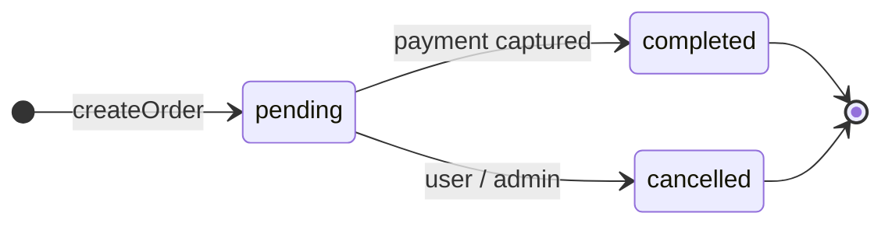

# Orders Module

`functions/src/modules/orders`

Owns the **order lifecycle**: creation, updates, status transitions, and payment
tracking. An order is the durable record of what a customer bought, for how much,
where it ships, and where it is in the fulfillment + payment flow. Orders are the
hub the payment (`ledger`) and document (`documents`) modules react to.

:::info Conventions
Timestamps are epoch **millis** (`Date.now()`). The order's monetary fields
(`cart.cartTotal`, `cartVat`, `cartDiscount`, `deliveryPrice`) are produced by the
shared `getCartCost` calculator (`@jsdev_ninja/core`) — the `ledger` converts to
integer **agorot** at the boundary. All reads/writes are tenant-scoped via
`FirebaseAPI.firestore.getPath` → `{companyId}/{storeId}/{collectionName}/{docId}`.
:::

## Collections

| Collection | Path | Purpose |
| ---------- | ---- | ------- |
| `orders`   | `{companyId}/{storeId}/orders/{orderId}` | The order document. `orderId` is deterministic — it equals the source `cart.id`. |

The module **owns** only `orders`. `createOrder` reads `products` / `discounts` /
store config to validate, and `documents` / `ledger` write back `deliveryNote`,
`invoice`, `ezReceipt` etc. onto the order — but those collections are owned by
their respective modules.

## Order schema (`TOrder`)

Defined in `@jsdev_ninja/core` (`packages/core/lib/entities/Order.ts`).

**Identity & tenant**

| Field | Type | Notes |
| ----- | ---- | ----- |
| `type` | `"Order"` | Discriminator. |
| `id` | string | Order id = source `cart.id` (deterministic / idempotent). |
| `companyId`, `storeId` | string | Tenant scope. |
| `userId` | string | Buyer's auth uid. |
| `createdBy` | `"user" \| "admin"` | Who placed it. |

**Lifecycle**

| Field | Type | Notes |
| ----- | ---- | ----- |
| `status` | enum | Fulfillment lifecycle — see [Status lifecycle](#status-lifecycle). |
| `paymentType` | `PaymentTypeSchema?` | e.g. `j5` (capture-later) / `external` (cash). |
| `paymentStatus` | enum | Payment state — see [Status lifecycle](#status-lifecycle). |

**Cart & money**

| Field | Type | Notes |
| ----- | ---- | ----- |
| `cart` | `{ id, items[], cartDiscount, cartTotal, cartVat, deliveryPrice? }` | The priced line items + totals (from `getCartCost`). |
| `storeOptions` | `{ deliveryPrice?, freeDeliveryPrice?, isVatIncludedInPrice?, freeShipping? }` | Pricing context snapshotted at order time. |
| `originalAmount?` | number | What the client pays. |
| `actualAmount?` | number | What the store charges (capture amount). |

**Dates**

| Field | Type | Notes |
| ----- | ---- | ----- |
| `date` | number (millis) | Order created. |
| `deliveryDate` | number (millis) | Requested delivery date. |

**Customer & B2B**

| Field | Type | Notes |
| ----- | ---- | ----- |
| `client?` | `Profile` | Buyer profile. |
| `address?` | `Address` | Delivery address. |
| `nameOnInvoice?` `emailOnInvoice?` `phoneNumberOnInvoice?` `clientComment?` | string | Checkout form fields. |
| `companyName?` `companyNumber?` `contact?` `poNumber?` | — | B2B buyer details (`companyNumber` = ח.פ / עוסק). |
| `outOfStockPolicy?` | `"substitute" \| "remove"` | Fulfillment preference. |
| `organizationId?` `billingAccount?` | — | B2B organization + chosen billing account. |

**Attached documents & audit**

| Field | Type | Notes |
| ----- | ---- | ----- |
| `deliveryNote?` `invoice?` `ezInvoice?` `ezDeliveryNote?` `ezReceipt?` | — | Written by the `documents` module after fulfillment/billing. |
| `invoicePaidAt?` | number (millis) | Set when an admin records full payment against the invoice. |
| `updatedBy?` `updatedAt?` | string / millis | Audit — stamped by admin/server writes. |

## Lifecycle

`status` (fulfillment) and `paymentStatus` (money) are **separate axes**.

### Status & payment state

| `status` | Meaning |
| -------- | ------- |
| `pending` | Order placed. |
| `cancelled` | Cancelled by user/admin. |
| `completed` | Paid/captured by admin. |
| `refunded` | Defined; no active flow writes it. |
| `draft` | **Deprecated** — legacy; new orders start at `pending`. |
| `processing` | **Deprecated** — was "approved by admin". |
| `in_delivery` / `delivered` | **Deprecated** — fulfillment-progress states, no longer used. |

| `paymentStatus` | Meaning |
| --------------- | ------- |
| `pending` | Awaiting payment. |
| `pending_j5` | J5 authorization placed, awaiting admin capture. |
| `completed` | Captured / paid. |
| `failed` | Payment failed. |
| `refunded` | Refunded. |
| `external` | **Deprecated** — cash-on-delivery (no online payment). |

### Order lifecycle

After the deprecations, the active journey is simple — an order is placed, then it
is either paid (captured) or cancelled:

**Active payment path** (`paymentStatus` axis) — J5 capture-later:

`createOrder` → `pending` → customer authorizes the J5 hold → `pending_j5` → an
admin **completes the order** (`status → completed`). That transition makes
`onOrderUpdate` emit `order.completed`, which the ledger's
`chargeJ5OnOrderCompleted` subscriber consumes to capture the J5 hold; the
resulting `hyp_capture` transaction triggers `onTransactionPostedMarkOrderPaid`,
which flips `paymentStatus → completed`. **Completing the order is what drives the
charge** — `status: completed` is set first, and the capture + `paymentStatus:
completed` follow asynchronously. (`status` moves `pending → cancelled` on an
admin/user cancel instead.) `onOrderUpdate` emits `order.completed` /
`order.cancelled` as those transitions occur; the module does not hard-enforce
transition order. See [Payment flows → Scenario 1](/architecture/payment-flows)
for the full sequence.

:::info `order.completed` drives both flows — split by `paymentType`
Two subscribers listen to `order.completed`, scoped to **disjoint** payment types
(exactly one fires per order):
- **`j5`** → `ledger: chargeJ5OnOrderCompleted` captures the J5 hold (charges the card).
- **`external`** → `documents: createDeliveryNoteOnOrderCompleted` auto-creates the
  delivery note (→ `documents.delivery_note_created` → AR accrual). No card charge;
  an admin records payment later, and `recordInvoicePayment` then sets
  `paymentStatus: "completed"`.

See [Payment flows](/architecture/payment-flows) — Scenario 1 (J5), Scenario 3 (external).
:::

:::caution `completed` ≠ paid (J5)
`status: completed` only means an admin approved/completed the order — it is set
**before** the J5 capture runs. If the capture fails, the order stays `completed`
with `paymentStatus: pending_j5`. **Gate fulfillment and "is it paid?" on
`paymentStatus`, never on `status`.**
:::

:::caution Deprecated
The legacy fulfillment states (`draft`, `processing`, `in_delivery`, `delivered`)
and the `external` (cash) payment status are **deprecated** — kept in the schema
enums for historical reads only, not part of the active flow.
:::

## Public surface (`./index.ts`)

**Cloud Functions**

| Function | Kind | Purpose |
| -------- | ---- | ------- |
| `createOrder` | callable (v2) | Auth required. Validates tenant, then `orderService.create` writes the order + emits `order.placed` atomically. |
| `updateOrder` | callable (v2) | Auth required. `orderService.update` patches the order (`updatedAt`/`updatedBy` stamped). |
| `onOrderUpdate` | Firestore `onUpdate` trigger | Audit-logs every change (with a field diff); emits `order.completed` on `→ completed` and `order.cancelled` on `→ cancelled`. |
| `onTransactionPostedMarkOrderPaid` | subscriber (`ledger.transaction_posted`) | Flips `paymentStatus → completed` when a capture/payment posts to the ledger. |

**Events** — `OrderEventTypes` enum + `OrderPlacedPayload`, `OrderCancelledPayload` Zod schemas.

## Events emitted

| Event | When | Emitter |
| ----- | ---- | ------- |
| `order.placed` | every new order, in the create transaction | `orderService.create` |
| `order.cancelled` | order transitions to `cancelled` | `onOrderUpdate` (inline) |
| `order.completed` | order transitions to `completed` | `onOrderUpdate` (inline) |

Consumers of `order.placed`: `closeCartOnOrderPlaced` (cart module → closes the
cart) and `onOrderPlacedAdminEmail` (notifications → store-owner email). One event,
two subscribers — fan-out, not a double-fire.

## Order placement flow

1. Checkout (or admin) calls the **`createOrder`** callable with the order + tenant.
2. `createOrder` checks auth and resolves `companyId`/`storeId` (from `data` or the auth token), then calls `orderService.create`.
3. `orderService.create` runs **one Firestore transaction** that writes the order doc (`id = cart.id`) **and** emits `order.placed` via `emit(tx, …)` — both commit or neither (atomic).
4. `order.placed` fans out: the cart is closed and the admin email is sent.
5. Payment proceeds separately, and **depends on `paymentType`**:
   - **J5** — the customer authorizes a hold (`paymentStatus → pending_j5`); when an admin later **completes** the order, `order.completed` drives the ledger's `chargeJ5OnOrderCompleted` capture → `hyp_capture` → `onTransactionPostedMarkOrderPaid` sets `paymentStatus → completed`. See [Payment flows → Scenario 1](/architecture/payment-flows).
   - **External** (cash / credit-terms) — no online charge on completion; the order is fulfilled and an admin records the payment manually later. See [Payment flows → Scenario 3](/architecture/payment-flows).

:::note Idempotency
The order id is deterministic (`= cart.id`), so retries/refreshes target the same
document rather than creating duplicates.
:::
